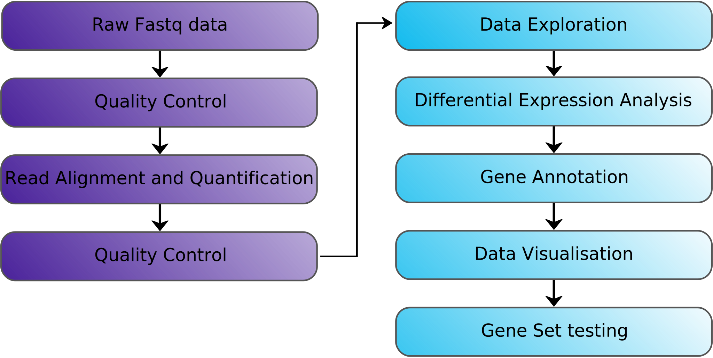
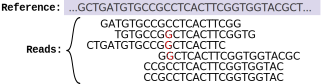
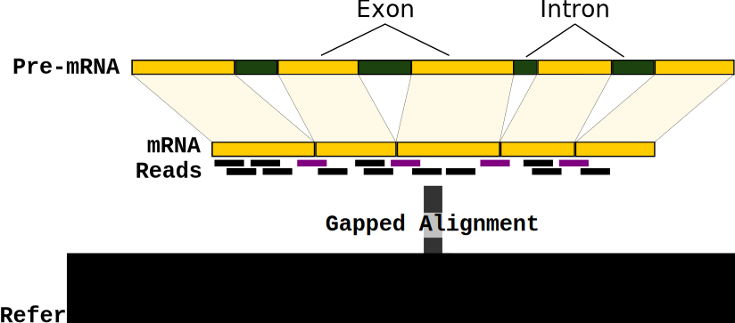
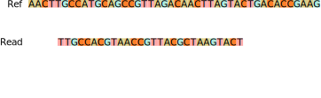
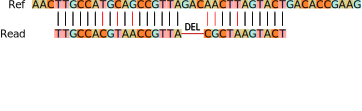
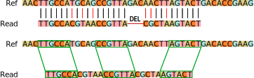
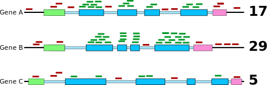
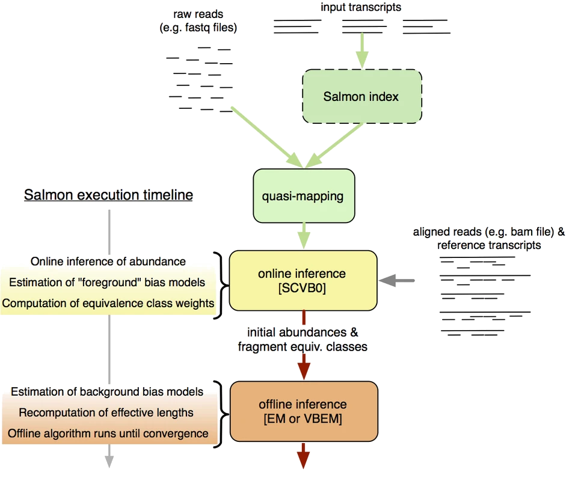
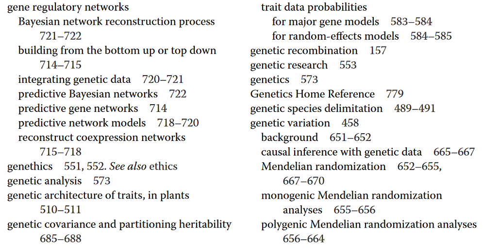

## Differential Gene Expression Analysis Workflow {#less_space_after_title}

<div style="line-height: 50%;"><br></div>



## Traditional Alignment

AIM: Given a reference sequence and a set of short reads, align each read to
the reference sequence finding the most likely origin of the read sequence.



## Alignment - Splicing aware alignment



<br>

:::centered
Commonly used aligners: _STAR_, _HISAT2_
:::

## Alignment

Traditional alignment is (relatively) slow and computationally intensive
    



## Alignment

Traditional alignment is (relatively) slow and computationally intensive
    



## Alignment

Traditional alignment is (relatively) slow and computationally intensive
    


:::centered        
**switch to *quasi-mapping* (Salmon) or *pseudo-alignment* (Kallisto)**
:::

## Why are Pseudo-alignment methods faster?

* Unlike alignment based methods, pseudo-alignment methods focus on transcriptome  
  (~2% of the genome in human)

* Use exact k-mer matching rather than aligning whole reads with mismatches and indels
    



## Quantification tools

* Alignment based

  * BAM file as input → reads must be mapped prior to quantification
  * Quantification using simple counting procedure
  * Pros: Intuitive
  * Cons: Slow and cannot correct for biases in RNA-seq data
  * Tools: HTseq, SubRead, etc. 

<br>

* Alignment-free (quasi-mapping or pseudoalignment)

  * FASTQ files as input → base-to-base alignment of the reads is avoided
  * Pros: Very fast and considers biases in sequence composition
  * Cons: Not as intuitive
  * Tools: Kallisto, Sailfish, **Salmon**, etc.
    
    
## What is read quantification?

**Quantification**: How many reads have come from a genomic feature?

* genomic feature can be a gene or transcript or exon, but usually **gene**

If we had mapped our reads to the genome (rather than the transcript sequences),
our mapping would look like this:



As we know the transcript locations (from an annotation file in [GFF or GTF format](https://www.ensembl.org/info/website/upload/gff.html)), the simplest approach is to count how many reads overlap each gene.


## What is read quantification?

:::notes
However, Salmon does not work this way. 
We have mapped to the transcript sequences, not the genome. 
Quantification is performed as part of the quasi-mapping process.
:::

_Salmon_ performs quantification as part of the quasi-mapping process, directly against the transcriptome.

Algorithm accounts for several biases:

* **Multimapping**: reads which map equally well to multiple locations.
* **GC bias**: higher GC content sequences are less likely to be observed as PCR is not as efficient.
* **Positional bias**: the 3' end of transcripts are often more likely to be observed.
* **Complexity bias**: some sequences are easier to be bound and amplified than others.
* **Sequence-based bias**: differential binding efficiency of random hexamer primers during PCR.
* **Fragment length bias**: induced by size selection.

:::centered
Methods like _Salmon_ attempt to mitigate the effect of technical biases by  
**estimating sample-specific bias parameters**.
:::


## Salmon workflow



:::centered
Patro *et al.* (2017) Nature Methods [doi:10.1038/nmeth.4197](https://doi.org/10.1038/nmeth.4197)
:::


## Salmon workflow: indexing 

Genome/Transcriptome indexing is often required by bioinformatic tools such as aligners. 



Similar to a book index, it allows the (pseudo)alignment algorithms to find regions of the large reference genome much quicker. 


## Salmon workflow: indexing 

_Salmon_:

* Index is built for the transcriptome reference

* But we also include the reference genome as a "decoy" 
  * Accounts for mapping of reads that might be similar to an annotated transcript, but are in fact from residual DNA contamination.


## Salmon workflow: indexing 

Example code:

```bash
# concatenate FASTA files for the transcriptome and genome
cat transcripts.fasta genome.fasta > gentrome.fasta

# create a text file with the names of the genomic sequences (i.e. chrosomomes/scaffolds)
zcat genome.fasta | grep ">" | cut -d " " -f 1 | sed 's/>//' > decoys.txt

# run the indexing
salmon index -t references/gentrome.fasta -d decoys.txt -i salmon_index
```

:::centered
See [this tutorial](https://combine-lab.github.io/alevin-tutorial/2019/selective-alignment/) for details.
:::


## Salmon workflow: quantification

Once we have the index, we can proceed with quasi-mapping and quantification: 

```bash
salmon quant \
    -i salmon_index \
    -l A \
    -1 SAMPLE_R1.fastq.gz \
    -2 SAMPLE_R2.fastq.gz \
    -o output/directory/SAMPLE \
    --gcBias --seqBias
```

Using `--gcBias` and `--seqBias` options accounts for the biases mentioned earlier


## Salmon workflow: quantification

Main output is a tab-delimited (TSV) file for each sample we process: 

```
Name                  Length  EffectiveLength  TPM       NumReads
ENSMUST00000177564.1  16      15.000           0.000000  0.000
ENSMUST00000196221.1  9       9.000            0.000000  0.000
ENSMUST00000179664.1  11      11.000           0.000000  0.000
ENSMUST00000178537.1  12      12.000           0.000000  0.000
ENSMUST00000178862.1  14      13.000           0.000000  0.000
ENSMUST00000179520.1  11      11.000           0.000000  0.000
ENSMUST00000179883.1  16      15.000           0.000000  0.000
ENSMUST00000195858.1  10      10.000           0.000000  0.000
ENSMUST00000179932.1  12      12.000           0.000000  0.000
```

:::centered
These are the files we will use in downstream differential expression analysis
:::


## Exercises

:::centered
[**Link to practical**](03_Quantification_with_Salmon_practical.html#Transcriptome_indexing)
:::

1. Create and index to the transcriptome with _Salmon_
2. Quantify transcript expression using _Salmon_