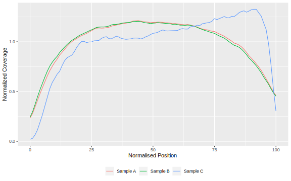

## RNA-seq Analysis Workflow {#less_space_after_title}

<div style="line-height: 50%;"><br></div>


## Bioinformatic workflows

Running bioinformatic workflows can be challenging: 

* Large number of software packages

* Possibly many samples to process 

* Complex dependencies between analysis steps

<br>

Running such an analysis step-by-step can be tedious, error-prone and not always the most efficient.


## Workflow managing software

Workflow managers help to solve this challenge: 

* Manage the running of each step of the pipeline, by feeding the output from one step to the next step

* Automatically install the necessary software for each step of the analysis

* Can run on multiple compute platforms, from a local laptop to a High Performance Compute cluster


## Nextflow 

* Active community of users and developers

* Many community-developed pipelines available online 
  * [**nf-core project**](https://nf-co.re/): collection of well-documented, best-practice bioinformatic workflow repositories


:::centered
Check out the list of [current pipelines](https://nf-co.re/pipelines) available from this community!
:::


## RNA-seq workflow: `nf-core/rnaseq`

:::centered
Best-practices workflow for RNA-seq data processing (up to expression quantification).
:::


## RNA-seq workflow: `nf-core/rnaseq`

Best-practices workflow for RNA-seq data processing (up to expression quantification): 

* **Quality control** of raw reads using _FastQC_.

* **Adapter removal** and **quality trimming** using _Trim Galore!_.

* **Quantification** of gene expression using _Salmon_. 

* **Alignment** of reads to a reference genome using _STAR_ → allows to extract **quality metrics** of interest.


## `nf-core/rnaseq`: the samplesheet

Before analysis prepare a CSV file with information about each sample:

```
sample,fastq_1,fastq_2,strandedness
SRR7657872,fastq/SRR7657872_1.fastq.gz,fastq/SRR7657872_2.fastq.gz,auto
SRR7657874,fastq/SRR7657874_1.fastq.gz,fastq/SRR7657874_2.fastq.gz,auto
SRR7657876,fastq/SRR7657876_1.fastq.gz,fastq/SRR7657876_2.fastq.gz,auto
SRR7657877,fastq/SRR7657877_1.fastq.gz,fastq/SRR7657877_2.fastq.gz,auto
```

* Sample name

* Path to read 1 FASTQ file

* Path to read 2 FASTQ file

* Type of library, if known (stranded or unstranded)

<br>

:::centered
**Check the [usage documentation](https://nf-co.re/rnaseq/latest/docs/usage)!**
:::

## `nf-core/rnaseq`: running

```bash
nextflow run nf-core/rnaseq \
  -r 3.12.0 -profile singularity \
  --max_cpus 8 --max_memory 15.GB \
  --input data/nextflow_samplesheet.csv \
  --outdir results/rnaseq \
  --fasta "$PWD/references/Mus_musculus.GRCm38.dna_sm.primary_assembly.fa" \
  --gtf "$PWD/references/Mus_musculus.GRCm38.102.gtf.gz" \
  --aligner star_salmon \
  --extra_salmon_quant_args "--seqBias --gcBias" \
  --skip_deseq2_qc
```

Note that the `\` is used to split the command across multiple lines. 
Make sure that there is **no space** after the `\` symbol, otherwise it will break the code!

::: notes
* **`nextflow run nf-core/rnaseq`** indicates we want to run the workflow available from https://github.com/nf-core/rnaseq. This will automatically download all the workflow files, if it's the first time you run it. 
* **`-r 3.12.0`** indicates we want to run version 3.12.0 of the pipeline (at the time of writing this is the latest version available at https://nf-co.re/rnaseq/). 
  If you don't include this option, the latest version available will be used. 
  When working on a project, it's a good idea to fix the version used at the time, so in the future you can reproduce the exact same analysis if needed.
* **`-profile singularity`** is the mode we want to use for software management. 
  Singularity is recommended when running analysis on HPC clusters. 
  An alternative is to use `docker` (which you would need to install separately on your computer).
* **`--max_cpus`** and **`--max_memory`** are options that restrict the pipeline to use those many resources. 
  When running the analysis on a HPC you should not set this options. 
  However, since we are running this on a local computer, we set the options to match the available resources on our computer. 
* **`--input`** is the samplesheet CSV file containing information about our samples names and the directory paths to their respective FASTQ files. 
  We covered this format in the previous section, and it is also detailed in the [documentation](https://nf-co.re/rnaseq/latest/docs/usage).
* **`--outdir`** is the output directory where we want our results to be saved. This directory will be created if it does not already exist.
* **`--fasta`** and **`--gtf`** are the directory paths to the reference genome and gene annotation, respectively. 
  These can be typically be downloaded from public repositories such as [ENSEMBL](https://www.ensembl.org/index.html).
  _Nextflow_ requires these to be the _full path_ (i.e. starting from the root of the filesystem). 
  As a trick to save typing, we used the environment variable `$PWD`, which stores our current working directory. 
* **`--aligner star_salmon`** indicates we want to use _STAR_ as the software to align reads against the reference genome and _Salmon_ as the software to quantify gene expression. This is the default option, but we specified it anyway to be more explicit. 
* **`--extra_salmon_quant_args`** is used to pass extra arguments to the _Salmon_ software. 
  We used this to ensure that _Salmon_ considers GC and sequence composition biases when performing its quantification. 
  We recommend using these options, as they usually lead to a better quantification. 
* **`--skip_deseq2_qc`** indicates we do not want the pipeline to perform downstream analysis using the _DEseq2_ R package. 
  We will perform this downstream analysis ourselves later on. 
:::


## `nf-core/rnaseq`: running

Pipeline progress is printed to the screen

```
[c6/11e749] process > NFCORE_RNASEQ:RNASEQ:PREPARE_GENOME:GUNZIP_GTF (Mus_musculus.GRCm38.102.gtf.gz) [100%] 1 of 1 ✔
[-        ] process > NFCORE_RNASEQ:RNASEQ:PREPARE_GENOME:GTF2BED                                     [  0%] 0 of 1
[-        ] process > NFCORE_RNASEQ:RNASEQ:PREPARE_GENOME:GTF_GENE_FILTER                             [  0%] 0 of 1
[-        ] process > NFCORE_RNASEQ:RNASEQ:PREPARE_GENOME:MAKE_TRANSCRIPTS_FASTA                       -
[67/d7d69c] process > NFCORE_RNASEQ:RNASEQ:PREPARE_GENOME:CUSTOM_GETCHROMSIZES (Mus_musculus.GRCm3... [100%] 1 of 1 ✔
[-        ] process > NFCORE_RNASEQ:RNASEQ:PREPARE_GENOME:STAR_GENOMEGENERATE                         [100%] 1 of 1 ✔
[e3/59b09a] process > NFCORE_RNASEQ:RNASEQ:INPUT_CHECK:SAMPLESHEET_CHECK (nextflow_samplesheet.csv)   [100%] 1 of 1 ✔
[-        ] process > NFCORE_RNASEQ:RNASEQ:CAT_FASTQ                                                  -
[-        ] process > NFCORE_RNASEQ:RNASEQ:FASTQ_SUBSAMPLE_FQ_SALMON:SALMON_INDEX                     -
[c2/c0caca] process > NFCORE_RNASEQ:RNASEQ:FASTQ_SUBSAMPLE_FQ_SALMON:FQ_SUBSAMPLE (SRR7657874)        [ 16%] 2 of 12
[-        ] process > NFCORE_RNASEQ:RNASEQ:FASTQ_SUBSAMPLE_FQ_SALMON:SALMON_QUANT                     -
[-        ] process > NFCORE_RNASEQ:RNASEQ:FASTQ_FASTQC_UMITOOLS_TRIMGALORE:FASTQC                    -
[-        ] process > NFCORE_RNASEQ:RNASEQ:FASTQ_FASTQC_UMITOOLS_TRIMGALORE:TRIMGALORE                -
[-        ] process > NFCORE_RNASEQ:RNASEQ:ALIGN_STAR:STAR_ALIGN                                      [  8%] 1 of 2
```


## `nf-core/rnaseq`: running

Once complete: 

```
-[nf-core/rnaseq] Pipeline completed successfully-
Completed at: 18-May-2022 08:08:25
Duration    : 4h 13m
CPU hours   : 8.1
Succeeded   : 343
```


## `nf-core/rnaseq`: outputs

* **MultiQC report**: quality control report; located in `multiqc/star_salmon/multiqc_report.html`.

* **Transcript quantification**: tabular files generated by _Salmon_; located in `star_salmon/<SAMPLE NAME>/quant.sf`.

* **Coverage tracks**: bigWig files that can be used for visualisation in IGV; located in `star_salmon/bigwig/`.


## `nf-core/rnaseq`: exercise

:::centered
[**Link to full exercise**](04b_nextflow_rnaseq_practical.html#Exercise_1)
:::

For this exercise, we will use small FASTQ files for 4 of our samples and run them through the `nf-core/rnaseq` workflow. 
This is so the pipeline completes within a reasonable time. 

1. Create a new directory in the course materials folder called `scripts`.
2. Create a new shell script inside that folder called `01-rnaseq_workflow.sh` and copy/paste the _Nextflow_ command shown above.
  You can use the command-line text editor `nano` or another text editor of your choice. 
3. Run the shell script using `bash`. 
  Based on the file paths specified in the `--input` and `--output` options, think about which directory you should be launching the script from. 

Make sure the pipeline starts running without any apparent errors, printing its progress on the screen.
It will take some time to run, so you can leave it running to complete. 
We will look at its outputs in the next section. 


## Alignment-based quality control

Why perform alignment if _Salmon_ is so fast?

Although expression quantification can be quickly done with _Salmon_'s pseudo-alignment algorithm, aligning reads to the genome allows us to extract several quality metrics of interest: 

* Alignment rates

* Read duplication rates

* Gene body coverage

* Complexity curves


## Alignment rate

Depends on:

* Quality of Reference Genome

* Quality of library prep and sequencing

* For human and mouse > 95%

`nf-core/rnaseq` workflow allows to check for:

* Contamination from a suspected organism (e.g. human) → uses _BBSplit_ software

* Presence of ribossomal RNA in total RNA library protocols (i.e. not polyA-enriched) → uses _SortMeRNA_ software


## Read duplication

Duplicate reads are reads that come from the same DNA fragment (or cDNA, in the case of RNA-seq). 


Bioinformatically _inferred_ as reads aligning to the same coordinates of the reference genome.

## Read duplication

In RNA-seq not as trivial as the chances of reads aligning to the same coordinates increases as: 

* We are only sequencing a fraction of the genome (transcripts)

* Some transcripts might be highly expressed (many reads align to a restricted region)

<br>

For example the human exome is ~30 Mb therefore there are < 30 million possible reads.

Duplication rates in RNAseq can be > 40%, therefore duplicate removal in RNA-seq is generally not recommended. 

<!-- However, we can still assess the extent to which read duplication is an issue. -->


## Read duplication: `dupRadar`

R/Bioconductor package [`dupRadar`](https://bioconductor.org/packages/release/bioc/vignettes/dupRadar/inst/doc/dupRadar.html) considers the relationship between transcript length, transcript expression level and duplicate rates. 


## Transcript coverage

Expect uniform distribution of reads along the gene body, with no bias towards the 5' or 3' ends.

A 3' bias may indicate poor RNA quality due to RNA degradation. 




## Complexity curve

Would more sequencing be beneficial? 


<!-- ## QC of aligned reads - Insert Size

* Insert size is the length of the fragment of mRNA from which the reads are
derived


 -->

## QC Goals 
 
* Ensure the experiment generated the expected data

* Check if the sequencing depth and alignment rates are similar across samples 

* Identify poor alignment parameters (sample quality, library prep, something else?)

* Discover contamination from another organism or from DNA 

* Identify biases present in the data 


## Exercise

:::centered
[**Link to full exercise**](04b_nextflow_rnaseq_practical.html#Exercise_2)
:::

We've pre-processed several samples through the `nf-core/rnaseq` pipeline.
The results can be found in `preprocessed/rnaseq` on the course materials folder. 

Open the MultiQC report and answer the following questions: 

1. Was the quality of the raw reads good? Were there any reads with adapter contamination?
2. What was the fraction of reads mapped to the reference genome? Were there any samples with mapping rates below 90%?
3. Was there evidence of RNA degradation for any of the samples?
4. Would these samples have benefited from more sequencing?
