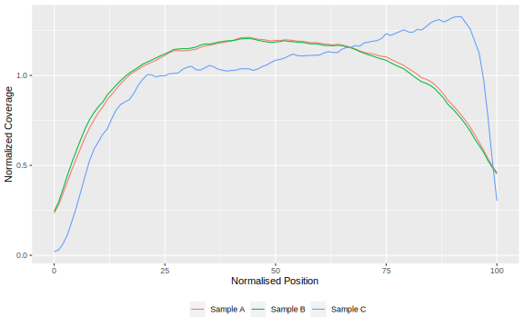

# RNA-seq analysis pipeline

So far, we covered some of the essential early steps of RNA-seq data processing, namely [raw read quality control](02_FastQC_practical.html) (with _FastQC_) and [quantification of gene expression](03_Quantification_with_Salmon_practical.html) (with _Salmon_). 
Although understanding how these steps work individually is a useful skill to have, running commands one-by-one doesn't scale well when working with several samples. 
Instead, bioinformaticians often rely on **standardised workflows/pipelines** to automate their analysis, ensuring **reproducibility** and **scalability**. 

In this section, we introduce a workflow developed by the _Nextflow_ community known as **`nf-core/rnaseq`** (see figure below). 
This workflow includes some of the steps we covered so far, with several additional quality-control steps, which can be extremely useful to identify issues early on in the analysis. 
The workflow is quite flexible, allowing the user to make alternative choices at different stages of the analysis. 

](https://raw.githubusercontent.com/nf-core/rnaseq/3.19.0/docs/images/nf-core-rnaseq_metro_map_grey.png)

One of the key advantages of this pipeline is that it collects **extensive quality control metrics**, aggregating them together into a single report. 
The [`nf-core/rnaseq` documentation](https://nf-co.re/rnaseq/) is very detailed and we encourage you to spend some time reading it if you want to modify your analysis to suit your needs. 
In this practical, we will run the pipeline to do the following: 

* **Quality control** of raw reads using _FastQC_.
* Removal of potential Illumina **adapter contamination** and **quality trimming** using _Trim Galore!_.
* **Alignment** of reads to a reference genome using _STAR_, followed by **quantification** using _Salmon_. 
* **Marking duplicates** using _Picard_ tools. 
* Collecting several **quality metrics** based on the alignment of reads to the reference genome. 

:::note
#### What is _Nextflow_?

_Nextflow_ is a program designed for building and running complex workflows (also known as pipelines). 
It simplifies the process of orchestrating complex computational pipelines that involve various tasks, inputs and outputs, and parallel processing. 
Nextflow is particularly well-suited for bioinformatics, where workflows often involve many steps, tools, and data transformations.
It's designed to work across different environments, including local machines, clusters, and cloud platforms.

There are many publicly-available _Nextflow_ pipelines available, which users can take advantage of.
In particular, _nf-core_ is a community-driven, open-source project aimed at providing [high-quality bioinformatics pipelines](https://nf-co.re/pipelines) for a wide range of applications. 
The project's goal is to offer standardized and well-documented workflows, allowing researchers to more easily set up and run complex analyses while following best practices and ensuring reproducibility.

By using _nf-core_ pipelines, researchers can save time and effort that would otherwise be spent developing and fine-tuning their own analysis workflows.
:::


## Preparing a samplesheet

To run this workflow we first need to prepare a **samplesheet**, as detailed in its [usage documentation](https://nf-co.re/rnaseq/latest/docs/usage). 
This is a CSV file including at least 3 columns: 

* **`sample`** - a sample name of your choice. This name will be used to name the output files, and it's a good idea to avoid spaces and special characters. 
* **`fastq_1`** and **`fastq_2`** - the path to the FASTQ files for the respective sample. 
* **`strandness`** - the strandness of the library, which is defined based on the type of kit you used. You can set this to **auto** and the workflow will determine the strandness automatically. However, if you know your library strandness, then it's a good idea to set it here, as it saves running time. 

Note that the same sample ID can appear in multiple rows of the samplesheet, as sometimes happens if the same sample is sequenced multiple times (e.g. in different sequencing lanes). 
The workflow will do the work of combining the files for you, so you don't need to worry about doing this beforehand. 

Here is what the samplesheet would look like for all our samples: 

```
sample,fastq_1,fastq_2,strandedness
SRR7657872,fastq/SRR7657872_1.fastq.gz,fastq/SRR7657872_2.fastq.gz,auto
SRR7657874,fastq/SRR7657874_1.fastq.gz,fastq/SRR7657874_2.fastq.gz,auto
SRR7657876,fastq/SRR7657876_1.fastq.gz,fastq/SRR7657876_2.fastq.gz,auto
SRR7657877,fastq/SRR7657877_1.fastq.gz,fastq/SRR7657877_2.fastq.gz,auto
SRR7657878,fastq/SRR7657878_1.fastq.gz,fastq/SRR7657878_2.fastq.gz,auto
SRR7657880,fastq/SRR7657880_1.fastq.gz,fastq/SRR7657880_2.fastq.gz,auto
SRR7657881,fastq/SRR7657881_1.fastq.gz,fastq/SRR7657881_2.fastq.gz,auto
SRR7657882,fastq/SRR7657882_1.fastq.gz,fastq/SRR7657882_2.fastq.gz,auto
SRR7657879,fastq/SRR7657879_1.fastq.gz,fastq/SRR7657879_2.fastq.gz,auto
SRR7657883,fastq/SRR7657883_1.fastq.gz,fastq/SRR7657883_2.fastq.gz,auto
SRR7657873,fastq/SRR7657873_1.fastq.gz,fastq/SRR7657873_2.fastq.gz,auto
SRR7657875,fastq/SRR7657875_1.fastq.gz,fastq/SRR7657875_2.fastq.gz,auto
```

In this case, we have decided to name each of our samples using the SRA identifier, but for your own samples you could have used more user-friendly names (e.g. "infected_d11_rep1", etc.).


## Running `nf-core/rnaseq`

Now that we have our samplesheet, **running the pipeline** is done using a single command (note: we use the `\` to break the long command across multiple lines): 

```bash
nextflow run nf-core/rnaseq \
  -r 3.19.0 -profile singularity \
  --input data/nextflow_samplesheet.csv \
  --outdir results/rnaseq \
  --fasta $PWD/references/Mus_musculus.GRCm38.dna_sm.primary_assembly.fa \
  --gtf $PWD/references/Mus_musculus.GRCm38.102.gtf.gz \
  --aligner star_salmon \
  --extra_salmon_quant_args '--seqBias --gcBias' \
  --skip_deseq2_qc
```

Here is a breakdown of the command: 

* **`nextflow run nf-core/rnaseq`** indicates we want to run the workflow available from https://github.com/nf-core/rnaseq. This will automatically download all the workflow files, if it's the first time you run it. 
* **`-r 3.19.0`** indicates we want to run version 3.19.0 of the pipeline (at the time of writing this is the latest version available at https://nf-co.re/rnaseq/). 
  If you don't include this option, the latest version available will be used. 
  When working on a project, it's a good idea to fix the version used at the time, so in the future you can reproduce the exact same analysis if needed.
* **`-profile singularity`** is the mode we want to use for software management. 
  Singularity is recommended when running analysis on HPC clusters. 
  An alternative is to use `docker` (which you would need to install separately on your computer).
* **`--input`** is the samplesheet CSV file containing information about our samples names and the directory paths to their respective FASTQ files. 
  We covered this format in the previous section, and it is also detailed in the [documentation](https://nf-co.re/rnaseq/latest/docs/usage).
* **`--outdir`** is the output directory where we want our results to be saved. This directory will be created if it does not already exist.
* **`--fasta`** and **`--gtf`** are the directory paths to the reference genome and gene annotation, respectively. 
  These can be typically be downloaded from public repositories such as [ENSEMBL](https://www.ensembl.org/index.html).
  _Nextflow_ requires these to be the _full path_ (i.e. starting from the root of the filesystem). 
  As a trick to save typing, we used the environment variable `$PWD`, which stores our current working directory. 
* **`--aligner star_salmon`** indicates we want to use _STAR_ as the software to align reads against the reference genome and _Salmon_ as the software to quantify gene expression. This is the default option, but we specified it anyway to be more explicit. 
* **`--extra_salmon_quant_args`** is used to pass extra arguments to the _Salmon_ software. 
  We used this to ensure that _Salmon_ considers GC and sequence composition biases when performing its quantification. 
  We recommend using these options, as they usually lead to a better quantification. 
* **`--skip_deseq2_qc`** indicates we do not want the pipeline to perform downstream analysis using the _DEseq2_ R package. 
  We will perform this downstream analysis ourselves later on. 

Once you launch the pipeline, you get its progress printed to the screen: 

```
[c6/11e749] process > NFCORE_RNASEQ:RNASEQ:PREPARE_GENOME:GUNZIP_GTF (Mus_musculus.GRCm38.102.gtf.gz) [100%] 1 of 1 ✔
[-        ] process > NFCORE_RNASEQ:RNASEQ:PREPARE_GENOME:GTF2BED                                     [  0%] 0 of 1
[-        ] process > NFCORE_RNASEQ:RNASEQ:PREPARE_GENOME:GTF_GENE_FILTER                             [  0%] 0 of 1
[-        ] process > NFCORE_RNASEQ:RNASEQ:PREPARE_GENOME:MAKE_TRANSCRIPTS_FASTA                       -
[67/d7d69c] process > NFCORE_RNASEQ:RNASEQ:PREPARE_GENOME:CUSTOM_GETCHROMSIZES (Mus_musculus.GRCm3... [100%] 1 of 1 ✔
[-        ] process > NFCORE_RNASEQ:RNASEQ:PREPARE_GENOME:STAR_GENOMEGENERATE                         [100%] 1 of 1 ✔
[e3/59b09a] process > NFCORE_RNASEQ:RNASEQ:INPUT_CHECK:SAMPLESHEET_CHECK (nextflow_samplesheet.csv)   [100%] 1 of 1 ✔
[-        ] process > NFCORE_RNASEQ:RNASEQ:CAT_FASTQ                                                  -
[-        ] process > NFCORE_RNASEQ:RNASEQ:FASTQ_SUBSAMPLE_FQ_SALMON:SALMON_INDEX                     -
[c2/c0caca] process > NFCORE_RNASEQ:RNASEQ:FASTQ_SUBSAMPLE_FQ_SALMON:FQ_SUBSAMPLE (SRR7657874)        [ 16%] 2 of 12
[-        ] process > NFCORE_RNASEQ:RNASEQ:FASTQ_SUBSAMPLE_FQ_SALMON:SALMON_QUANT                     -
[-        ] process > NFCORE_RNASEQ:RNASEQ:FASTQ_FASTQC_UMITOOLS_TRIMGALORE:FASTQC                    -
[-        ] process > NFCORE_RNASEQ:RNASEQ:FASTQ_FASTQC_UMITOOLS_TRIMGALORE:TRIMGALORE                -
[-        ] process > NFCORE_RNASEQ:RNASEQ:ALIGN_STAR:STAR_ALIGN                                      [  8%] 1 of 2

... more output omitted ...
```

Once the pipeline completes, we get a message similar to the following: 

```
-[nf-core/rnaseq] Pipeline completed successfully-
Completed at: 18-May-2022 08:08:25
Duration    : 4h 13m
CPU hours   : 8.1
Succeeded   : 343
```

### Exercise 1

:::exercise

For this exercise, we will use small FASTQ files for 4 of our samples and run them through the `nf-core/rnaseq` workflow. 
This is so the pipeline completes within a reasonable time. 

1. Create a new directory in the course materials folder called `scripts`.
2. Create a new shell script inside that folder called `01-rnaseq_workflow.sh` and copy/paste the _Nextflow_ command shown below.
  You can use the command-line text editor `nano` or another text editor of your choice. 
  
    ```bash
    nextflow run nf-core/rnaseq \
      -r 3.19.0 -profile singularity \
      --input data/nextflow_samplesheet.csv \
      --outdir results/rnaseq \
      --fasta "$PWD/references/Mus_musculus.GRCm38.dna_sm.chr14.fa.gz" \
      --gtf "$PWD/references/Mus_musculus.GRCm38.102.chr14.gtf.gz" \
      --aligner star_salmon \
      --extra_salmon_quant_args "--seqBias --gcBias" \
      --skip_deseq2_qc
    ```
  
3. Run the shell script using `bash`. 
  Based on the file paths specified in the `--input` and `--output` options, think about which directory you should be launching the script from. 

Make sure the pipeline starts running without any apparent errors, printing its progress on the screen.
It will take ~1h to run, so you can leave it running to complete. 
We will look at its outputs in the next section. 

<details><summary>Answer</summary>

**Question 1**

To keep things tidy, we first create a directory for our scripts: 

```bash
mkdir scripts
```

----

**Question 2** 

To create a shell script inside that folder we use `nano scripts/run_workflow.sh`. 
This opens a text editor inside the terminal, where we pasted the code shown above: 

```bash
#!/bin/bash

# process the data using the nf-core/rnaseq pipeline
nextflow run nf-core/rnaseq \
  -r 3.19.0 -profile singularity \
  --input data/nextflow_samplesheet.csv \
  --outdir results/rnaseq \
  --fasta "$PWD/references/Mus_musculus.GRCm38.dna_sm.chr14.fa.gz" \
  --gtf "$PWD/references/Mus_musculus.GRCm38.102.chr14.gtf.gz" \
  --aligner star_salmon \
  --extra_salmon_quant_args "--seqBias --gcBias" \
  --skip_deseq2_qc
```

We also added a shebang (`#!/bin/bash`), which is good practice when writing shell scripts and commented our code. 

----

**Question 3**

From the code above we can see that the path to the input samplesheet is given _relative_ to our project folder: `data/samplesheet`. 
Therefore, when we launch our script, we should make sure to be in that folder (rather than, for example, inside the scripts folder itself). 
In our training machines, this is located in `cd ~/Course_Materials`. 

Then, from that folder, we can run our script using: 

```bash
bash scripts/01-rnaseq_workflow.sh
```

As the workflow start to run, we get several messages printed to the screen: 

```
[c6/11e749] process > NFCORE_RNASEQ:RNASEQ:PREPARE_GENOME:GUNZIP_GTF (Mus_musculus.GRCm38.102.gtf.gz) [100%] 1 of 1 ✔
[-        ] process > NFCORE_RNASEQ:RNASEQ:PREPARE_GENOME:GTF2BED                                     [  0%] 0 of 1
[-        ] process > NFCORE_RNASEQ:RNASEQ:PREPARE_GENOME:GTF_GENE_FILTER                             [  0%] 0 of 1
[-        ] process > NFCORE_RNASEQ:RNASEQ:PREPARE_GENOME:MAKE_TRANSCRIPTS_FASTA                       -
[67/d7d69c] process > NFCORE_RNASEQ:RNASEQ:PREPARE_GENOME:CUSTOM_GETCHROMSIZES (Mus_musculus.GRCm3... [100%] 1 of 1 ✔
[-        ] process > NFCORE_RNASEQ:RNASEQ:PREPARE_GENOME:STAR_GENOMEGENERATE                         [100%] 1 of 1 ✔
[e3/59b09a] process > NFCORE_RNASEQ:RNASEQ:INPUT_CHECK:SAMPLESHEET_CHECK (nextflow_samplesheet.csv)   [100%] 1 of 1 ✔
[-        ] process > NFCORE_RNASEQ:RNASEQ:CAT_FASTQ                                                  -
[-        ] process > NFCORE_RNASEQ:RNASEQ:FASTQ_SUBSAMPLE_FQ_SALMON:SALMON_INDEX                     -
[c2/c0caca] process > NFCORE_RNASEQ:RNASEQ:FASTQ_SUBSAMPLE_FQ_SALMON:FQ_SUBSAMPLE (SRR7657874)        [ 16%] 2 of 12
[-        ] process > NFCORE_RNASEQ:RNASEQ:FASTQ_SUBSAMPLE_FQ_SALMON:SALMON_QUANT                     -
[-        ] process > NFCORE_RNASEQ:RNASEQ:FASTQ_FASTQC_UMITOOLS_TRIMGALORE:FASTQC                    -
[-        ] process > NFCORE_RNASEQ:RNASEQ:FASTQ_FASTQC_UMITOOLS_TRIMGALORE:TRIMGALORE                -
[-        ] process > NFCORE_RNASEQ:RNASEQ:ALIGN_STAR:STAR_ALIGN                                      [  8%] 1 of 2

... more output omitted ...
```

Once the workflow completes, we get a message such as: 

```
-[nf-core/rnaseq] Pipeline completed successfully-
Completed at: 18-May-2022 08:08:25
Duration    : 4h 13m
CPU hours   : 8.1
Succeeded   : 343
```

This indicates the workflow ran successfully. 

</details>
:::


## Pipeline outputs

The `nf-core/rnaseq` workflow generates many output files, which are explained in detail in the [workflow documentation](https://nf-co.re/rnaseq/latest/docs/output). 
We highlight some of the more relevant files we will use throughout our analysis: 

- **MultiQC report**: quality control report, which is usually the first thing to look at once we run our pipeline. 
  This is located in `multiqc/star_salmon/multiqc_report.html`.
- **Salmon quantification**: tabular files in TSV format containing the quantification of each transcript performed by _Salmon_. 
  We will use these files in a later section when we analyse the data in R. These files can be found in the `star_salmon/<SAMPLE NAME>/quant.sf` directory. 
- **Coverage tracks**: these files are in [bigWig format](https://genome.ucsc.edu/goldenPath/help/bigWig.html), which compactly stores the genome coverage of each sample across the genome. 
  These files can be visualised in [IGV](https://igv.org/). 
  You can find these files in `star_salmon/bigwig/`, with two files per sample: `*.forward.bigWig` representing the coverage on the forward strand and `*.reverse.bigWig` representing the coverage on the reverse strand. 
  The coverage values are **not normalised** to differences in library size across samples, therefore you should not use them to make strong inferences about gene expression differences across samples.
- **Alignment files**: reads aligned to the genome in the standard [BAM format](https://en.wikipedia.org/wiki/Binary_Alignment_Map). 
  These files can be used to visualise our reads aligned to the reference genome, also using [IGV](https://igv.org/). 
  For visualisation purposes using the bigWig files is more efficient. 
  However, looking at the BAM files may be useful for troubleshooting mapping issues, for example. 
  These files can be found in `star_salmon/*.Aligned.out.bam`.

There are many more output files, which can be useful depending on the analysis you want to do. 
But these are the main ones we will focus on for now. 


### Quality control

As mentioned above, one of the main benefits of using the `nf-core/rnaseq` workflow is that it generates a very thorough quality report. 
It uses the software _MultiQC_ to aggregate several quality statistics in a visual and interactive HTML report found in `multiqc/star_salmon/multiqc_report.html`.

We highlight some of the main sections, which you can navigate through the report's sidebar on the left. 


#### General stats

This section shows a table with general statistics about each sample, including how many reads were available, the percentage of duplicate reads (more on this below), and the percentage of reads that aligned to the reference genome. 
This is a summary table, which aggregates results from several of the other sections of the report.

In this table it's good to check: 

- What fraction of reads mapped to the genome? A very low value - say, below 90% - may indicate contamination issues. 
- What is the % of duplicated reads? A very high value - say, above 20% - may indicate issues with library complexity (more on this below).


#### DupRadar

One of the key steps in NGS analysis is the identication of so-called "duplicate reads". 
Duplicate reads are reads that come from the same DNA fragment (or cDNA, in the case of RNA-seq). 
_Ideally_, we would want to sequence each original molecule in our samples only once. 
However, as part of the Illumina library protocols it is often necessary to perform a PCR amplification step, to ensure there is enough material to proceed with the protocol. 
Again, _ideally_ this PCR step would occur without biases, and each original molecule would get amplified the same number of times. 
Finally, when we come to sequence these molecules, _ideally_ we would want to sequence them all exactly in the proportions they occur in the sample.

As you can imagine, there are many "_ideally_" statements in the previous paragraph. 
In reality, we cannot ensure that every molecule is represented in its original proportion, as (random and non-random) biases during the PCR and sequencing processes will create fluctuations around it. 

Bioinformatically, duplicates are inferred by looking at read pairs where their 5' positions align to the same location of the genome. 
If we find several pairs aligning to exactly the same coordinates, we may assume they came from the same DNA/cDNA fragment and therefore must be PCR duplicates. 
This assumption comes from the fact that we randomly shear (i.e. break) the DNA as part of the library preparation procedure and it would be unlikely that two sheared fragments would have breakpoints in exactly the same place in the original molecules present in the sample. 

While this last assumption is valid for whole genome sequencing, for RNA-seq this is not as straightforward, because only a small fraction of the genome is being sequenced (transcripts). 
The smaller a transcript is and the higher its expression, the higher is the probability of obtaining two fragments of the same size during the shearing process. 
Because of these two factors (transcript lenght and variable expression levels), typically duplicate removal is discouraged for RNA-seq analysis. 

However, we can still assess the quality of our library based on duplicate rates, by considering the relationship between transcript length, transcript expression level and duplicate rates. 
This analysis is performed by the `dupRadar` package, which is run as part of the `nf-core/rnaseq` workflow. 
Here is an example plot generated by this tool:

](https://raw.githubusercontent.com/nf-core/rnaseq/3.19.0/docs/images/dupradar_example_plot.png)

These plots show us the relationship between: 

* The expression of a gene measured as reads per kbp (i.e. accounting for the length of the transcript)
* And the percentage of duplicate reads (i.e. read pairs aligning to the same position of the genome)

A good quality library should show a profile similar to what is shown on the left, where the percentage of apparent duplicates increases as the level of expression of the gene increases. 
These might not represent actual PCR duplicates, but rather a consequence that the gene is highly expressed and so the probability of reads aligning to the same location of the genome increases. 

The plot on the right, on the other hand, shows an example of a more problematic library, where even genes with relative low expression show high percentage of duplicates. 

These files can be found in `star_salmon/dupradar/scatter_plot/*_duprateExpDens.pdf` (one file per sample). 


#### QualiMap: Gene Coverage Profile

The quality of the RNA can be assessed by looking at gene body coverage, i.e. the distribution of reads over gene bodies. 
Usually, we would expect a uniform distribution of reads along the gene body, with no bias towards the 5' or 3' ends.

A 3' bias (i.e. more reads on the 3' end, with a depletion on the 5' end) may indicate poor RNA quality, for example due to RNA degradation. 
It can also be caused by incomplete reverse transcription during the cDNA synthesis step of the library preparation protocols.

Often, researchers should have an indication of RNA quality prior to sequencing (e.g. from an Agilent BioAnalyser or from running the RNA on an electrophoresis gel).
The results of this bioinformatic analysis can therefore be confirmed/compared with prior quality control steps done in the lab.

Here is an example plot that may be obtained from this analysis:



This plot shows the normalised average coverage (read counts) along the transcript body.
The transcript lengths (x-axis) are scaled from 0 - 100, with the 5' end at the left and the 3' end at the right of the plot. 

In the image above we have 3 example samples, where one of them shows an enrichment in the 3' end of the transcript indicative of RNA degradation. 

### RSeqQC: Junction saturation

It is good to assess whether more sequencing would have been beneficial for our samples in order to capture a better picture of our expression landscape. 
We can imagine that if we sequenced too little, then we have a lot of missing information about our genes' expression. 
However, as we sequence more and more, our sequencing will become "saturated", such that new reads only result in sampling more of the same genes. 

An indirect way to assess sequencing saturation is to look at **junction saturation**.
This is a measure of how many known junctions (i.e. splice sites) we have detected in our samples. 
If we have sequenced enough, then we should have detected most of the known junctions in our samples.

Here is an example plot that may be obtained from this analysis:

](https://raw.githubusercontent.com/nf-core/rnaseq/3.19.0/docs/images/mqc_rseqc_junctionsaturation.png)

If we have covered most of the splice junctions, then the curves will appear to flatten, indicating that we have reached saturation.
On the other hand, if the curves are still showing an upward trend, then more sequencing may be beneficial.

Note that libraries with very high duplication rates will often quickly saturate. 
That is because the PCR amplification would have generated substantial redundancy in the library, leading to little ability to sequence new molecules.  

<!-- 
### Preseq: Complexity Curve

It is good to assess whether more sequencing would have been beneficial for our samples in order to capture a better picture of our expression landscape. 
We can imagine that if we sequenced too little, then we have a lot of missing information about our genes' expression. 
However, as we sequence more and more, our sequencing will become "saturated", such that new reads only result in sampling more of the same genes. 

Whether or not we reached this saturation depends on what is often referred to as the **library complexity**. 
For example, if our samples come from a mixed tissue, then we may expect a large number of genes being transcribed. 
Whereas if we have a simpler sample, for example from tissue micro-dissection or cell-sorted samples, then we may expect a smaller number of genes expressed. 
In the first scenario we need more reads, whereas in the second scenario we would need fewer reads. 

One way to assess sequencing saturation is to produce a **complexity curve**, where we sub-sample increasing fractions of our reads and check how many unique reads we have. 
Plotting this relationship results in curves such as the ones shown in the following image: 

](https://raw.githubusercontent.com/nf-core/rnaseq/3.19.0/docs/images/mqc_preseq_plot.png)

If we reached saturation of our library, then the curve will appear to flatten. 
This indicates that if we sequenced more, we would not really gain new information, and thus it would be a waste of resources. 
On the other hand, if the line was still showing an upward trend, then more sequencing would be beneficial. 

Note that libraries with very high duplication rates will often quickly saturate. 
That is because the PCR amplification would have generated substantial redundancy in the library, leading to little ability to sequence new molecules.  
-->


#### Other sections

There are several other sections in the MultiQC report, including: 

* **RSeqQC:** this section of the report has several additional quality statistics, derived from the genome alignment ([documentation](https://nf-co.re/rnaseq/latest/docs/output#rseqc)).
* **Samtools:** several alignment statistics, such as the percentage of mapped reads ([documentation](https://nf-co.re/rnaseq/latest/docs/output#samtools)). 
* **STAR:** specific statistics from the _STAR_ aligner, including how many reads mapped uniquely to the genome, how many multi-mappers and how many were left unmapped. 
* **FastQC:** summary plots from the _FastQC_ tool, which is run both before and after quality trimming ([documentation](https://nf-co.re/rnaseq/latest/docs/output#fastqc)). 
* **Cutadapt:** a short section showing how many reads were trimmed due to quality or having Illumina adapters present at the end of the read ([documentation](https://nf-co.re/rnaseq/latest/docs/output#trimgalore)).


### Salmon quantification

These files contain the output from the _Salmon_ quantification tool. 
These files contain the raw counts estimated by this software and will be the main input for the downstream analysis we will perform in _R_. 
The files are located in `star_salmon/<SAMPLE NAME>/quant.sf`. 

These files are tab-delimited and here is an example of their content:

```
Name                  Length  EffectiveLength  TPM       NumReads
ENSMUST00000177564.1  16      15.000           0.000000  0.000
ENSMUST00000196221.1  9       9.000            0.000000  0.000
ENSMUST00000179664.1  11      11.000           0.000000  0.000
ENSMUST00000178537.1  12      12.000           0.000000  0.000
ENSMUST00000178862.1  14      13.000           0.000000  0.000
ENSMUST00000179520.1  11      11.000           0.000000  0.000
ENSMUST00000179883.1  16      15.000           0.000000  0.000
ENSMUST00000195858.1  10      10.000           0.000000  0.000
ENSMUST00000179932.1  12      12.000           0.000000  0.000
```

The columns are: 

* **Name:** the name of the transcript. 
* **Length:** the length of the trascript. 
* **EffectiveLength:** the length of the transcript where reads mapped to, which _Salmon_ considers to be the "effective" length of that transcript.
* **TPM:** "Transcripts Per Million", which is a common _within sample_ count normalisation method. Note that these normalised values are discouraged for use when comparing across samples. 
* **NumReads:** the read counts estimated by _Salmon_. Note that these values can sometimes contain non-integer values, because _Salmon_ uses an estimation algorithm that accounts for isoforms of the same gene. 

We will later see how to import these files into R for downstream analysis. 


### Coverage tracks

* File location: `star_salmon/bigwig/*.forward.bigWig` and `star_salmon/bigwig/*.reverse.bigWig`

These files contain information about genome coverage, based on the reads aligned to the reference genome. 
The typical use for these files is for visualisation purposes using the IGV software. 

- Open IGV (from the toolbar on the left).
- Choose the "Mouse (mm10)" genome on the top-right drop-down menu.
- Go to "File" -> "Load from file..." and then navigate to `star_salmon/bigwig/`.
- Choose all the "bigWig" files in this folder (you can use the <kbd>Shift</kbd> key to select multiple files) and click "Open".
- On the search bar at the top you can search for any gene names of your choice or navigate to a particular coordinate region. 

IGV is reasonably user-friendly and has many options to customise the display. 
By right-clicking on the track names on the left you can see many options available. 


### Alignment files

* File location: `star_salmon/*.markdup.sorted.bam`

These files contain the reads aligned to the reference genome. 
Similarly to what was detailed above for bigWig files, you can also load these files into IGV to inspect the read alignments to the genome. 

This may be useful to identify potential mapping issues, if your quality control steps revealed something unusual.


### Exercise 2

:::exercise

We've pre-processed several samples through the `nf-core/rnaseq` pipeline.
The results can be found in `preprocessed/rnaseq` on the course materials folder. 

Open the MultiQC report and answer the following questions: 

1. Was the quality of the raw reads good? Were there any reads with adapter contamination?
  <details><summary>Hint</summary>You can look at the section of the report entitled "FastQC (raw)".</details>
2. What was the fraction of reads mapped to the reference genome? Were there any samples with mapping rates below 90%?
  <details><summary>Hint</summary>You can look at the section of the report entitled "General Stats".</details>
3. Was there evidence of RNA degradation for any of the samples?
  <details><summary>Hint</summary>You can look at the section of the report entitled "QualiMap: Gene Coverage Profile".</details>
4. Would these samples have benefited from more sequencing?
  <details><summary>Hint</summary>You can look at the section of the report entitled "Preseq: Complexity Curve".</details>

<details><summary>Answer</summary>

TODO - add some snapshots

</details>

:::