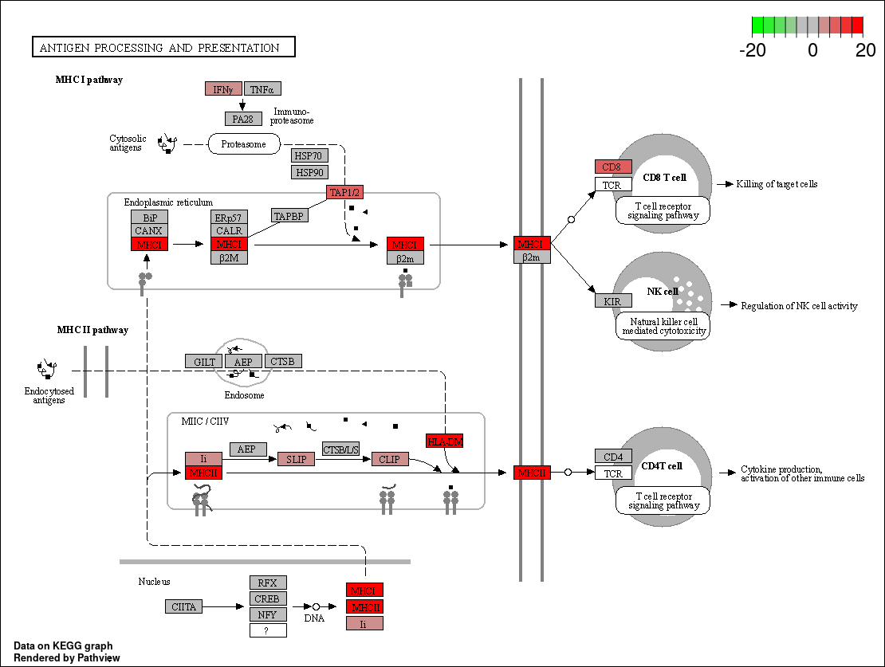
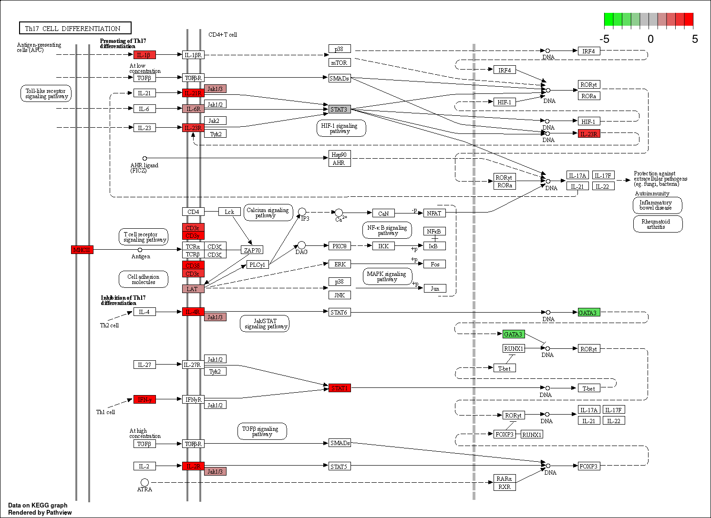
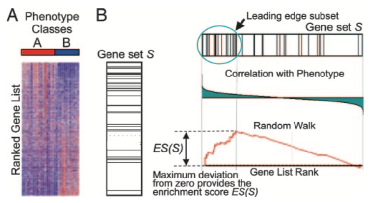

# Gene Set Testing

```{r setup, echo=FALSE, cache=FALSE}
knitr::opts_knit$set(root.dir = here::here("course_files"))
```

The list of differentially expressed genes is sometimes so long that its 
interpretation becomes cumbersome and time consuming. It may also be very
short while some genes have low p-value yet higher than the given threshold.

A common downstream procedure to combine information across genes is gene set
testing. It aims at finding pathways or gene networks the differentially
expressed genes play a role in.

Various ways exist to test for enrichment of biological pathways. We will look
into over representation and gene set enrichment analyses.

A gene set comprises genes that share a biological function, chromosomal
location, or any other relevant criterion.

To save time and effort there are a number of packages that make applying these
tests to a large number of gene sets simpler, and which will import gene lists 
for testing from various sources.

Today we will use 
[`clusterProfiler`](https://yulab-smu.github.io/clusterProfiler-book/index.html).

## Over-representation

This method tests whether genes in a pathway are present in a subset of our data
in a higher number than expected by chance (explanations derived from the 
[clusterProfiler manual](https://yulab-smu.github.io/clusterProfiler-book/index.html)).

Genes in the experiment are split in two ways:

* annotated to the pathway or not
* differentially expressed or not

We can then create a contingency table with:

* rows: genes in pathway or not
* columns: genes differentially expressed or not

And test for independence of the two variables with the Fisher exact test.

### `clusterProfiler`

`clusterprofiler` [@Yu2012] supports direct online access of the current KEGG
database (KEGG: Kyoto Encyclopedia of Genes and Genomes), rather than relying on
R annotation packages.
It also provides some nice visualisation options.

We first search the resource for mouse data:

```{r loadClusterProfiler, message=FALSE}
library(tidyverse)
library(clusterProfiler)

search_kegg_organism('mouse', by='common_name')
```

We will use the 'mmu' 'kegg_code'.

### KEGG enrichment analysis

The input for the KEGG enrichment analysis is the list of gene IDs of significant genes. 

We now load the R object keeping the outcome of the differential expression 
analysis for the d11 contrast.

```{r loadData}
res_d11_shrink <- readRDS("preprocessed/r_objects/res_infected_vs_uninfected_d11_annotated_shrink.rds")
```

We will only use genes that have:

* an adjusted p-value (FDR, False Discovery Rate) of less than 0.05
* and an absolute fold change greater than 2.

We need to remember to eliminate genes with missing values in the FDR as a result
of the independent filtering by DESeq2.

For this tool we need to use **Entrez IDs**, so we will also need to eliminate genes
with a missing Entrez ID (NA values in the 'Entrez' column).

```{r enrichKEGGprint}
sig_genes_entrez <- res_d11_shrink %>% 
  drop_na(Entrez, padj) %>% 
  filter(padj < 0.05 & abs(log2FoldChange) > 1) %>% 
  pull(Entrez)

kegg_results <- enrichKEGG(gene = sig_genes_entrez, organism = 'mmu')
as_tibble(kegg_results)
```

#### Visualise a pathway in a browser

`clusterProfiler` has a function `browseKegg` to view the KEGG pathway in a browser,
highlighting the genes we selected as differentially expressed.

We will show one of the top hits: pathway 'mmu04612' for 'Antigen processing and presentation'.

```{r browseKegg, eval=FALSE}
browseKEGG(kegg_results, 'mmu04612')
```

#### Visualise a pathway as a file

The package `pathview` [@Luo2013] can be used to generate figures of KEGG 
pathways. 

One advantage over the `clusterProfiler` browser function `browseKEGG()` is that genes can be
coloured according to fold change levels in our data. To do this we need
to pass `pathview` a named vector of fold change values (one could in fact
colour by any numeric vector, e.g. p-value).

The package plots the KEGG pathway to a `png` file in the working directory.

```{r pathview, message = FALSE}
library(pathview)
lfc <- res_d11_shrink$log2FoldChange
names(lfc) <- res_d11_shrink$Entrez
pathview(gene.data = lfc, 
         pathway.id = "mmu04612", 
         species = "mmu", 
         limit = list(gene = 20, cpd = 1))
```

```{r, include=FALSE, echo=FALSE}
# clear files when rendering
file.remove("mmu04612.pathview.png")
```

*mmu04612.pathview.png*:



### Exercise 1 {.challenge}

:::exercise
1. Use `pathview` to export a figure for "mmu04659" or "mmu04658", but this 
time only use genes that are statistically significant at padj < 0.01

<details><summary>Answer</summary>

First, we need to create a new list of genes using the new filter:

```{r solution1_pt1}
lfc <- res_d11_shrink %>% 
  drop_na(padj, Entrez) %>% 
  filter(padj < 0.01) %>% 
  pull(log2FoldChange, Entrez) 
```

Then, we can use the `pathview()` function as demonstrated above:

```{r solution1_pt2}
pathview(gene.data = lfc, 
         pathway.id = "mmu04659", 
         species = "mmu", 
         limit = list(gene = 5, cpd = 1))
```

This outputs an image to the local working directory. 



```{r, include=FALSE, echo=FALSE}
# clear files when rendering
file.remove("mmu04659.pathview.png")
```

</details>
:::

## GO term enrichment analysis

`clusterProfiler` can also perform over-representation analysis on GO terms 
using the function `enrichGO()`. For this analysis we will use Ensembl gene IDs 
instead of Entrez IDs and in order to do this we need to load another package 
which contains the mouse database called `org.Mm.eg.db`. 

To run the GO enrichment analysis, this time we also need a couple of extra 
things. Firstly, we should provide a list of the 'universe' of all the genes in 
our DE analysis not just the ones we have selected as significant. 

Gene Ontology terms are divided into 3 categories. 

- Metabolic Functions
- Biological Processes
- Cellular Components

For this analysis we will narrow our search terms in the 'Biological Processes'
Ontology so we can add the parameter "BP" with the 'ont' argument (the default 
is Molecular Functions). 

```{r GO analysis, message=FALSE, warning = FALSE}
library(org.Mm.eg.db)

# get ENSEMBL IDs for significant genes
sig_genes_ensembl <-  res_d11_shrink %>% 
  drop_na(padj) %>% 
  filter(padj < 0.01 & abs(log2FoldChange) > 2) %>% 
  pull(GeneID)

# get names for all the genes we have data for
universe <- res_d11_shrink$GeneID

# run enrichment analysis
go_results <- enrichGO(gene = sig_genes_ensembl, 
                       universe = universe,
                       OrgDb = org.Mm.eg.db,
                       keyType = "ENSEMBL",
                       ont = "BP",
                       pvalueCutoff = 0.01,
                       readable = TRUE)
```

We can use the `barplot()` function to visualise the results. Count is the number 
of differentially expressed in each gene ontology term.

```{r barplot}
barplot(go_results, showCategory = 20)
```

An alternative is the `dotplot()` version, which can be more informative. 
Gene ratio is Count divided by the number of genes in that GO term.

```{r dotplot}
dotplot(go_results, font.size = 14)
```

Another visualisation that can be nice to try is the `emapplot()` which shows the overlap between genes in the different GO terms.

```{r emap, fig.width=8, fig.height=8}
library(enrichplot)
ego_pt <- pairwise_termsim(go_results)
emapplot(ego_pt)
```


## GSEA analysis

Gene Set Enrichment Analysis (GSEA) identifies gene sets that are enriched in the dataset between samples [@Subramanian15545].

The software is distributed by the 
[Broad Institute](http://software.broadinstitute.org/gsea/index.jsp)
and is freely available for use by academic and non-profit organisations.
The Broad also provide a number of very well curated gene sets
for testing against your data - the [Molecular Signatures Database (MSigDB)](http://software.broadinstitute.org/gsea/msigdb/index.jsp). 
These are collections of human genes. Fortunately, these lists
have been translated to mouse equivalents by the Walter+Eliza Hall Institute
Bioinformatics service and made available for 
[download](http://bioinf.wehi.edu.au/MSigDB/index.html).
They are now also available from a recent R package
[msigdbr](https://cran.r-project.org/web/packages/msigdbr/index.html), which we will use.

Let's load `msigdbr` now.

```{r}
library(msigdbr)
```

The analysis is performed by:

1. ranking all genes in the data set  
2. identifying in the ranked data set the rank positions of all members of the 
gene set 
3. calculating an enrichment score (ES) that represents the difference between
the observed rankings and that which would be expected assuming a random rank
distribution.
 
The article describing the original software is available 
[here](http://www.pnas.org/content/102/43/15545.long),
while this 
[commentary on GSEA](https://www.ncbi.nlm.nih.gov/pmc/articles/PMC1266131/) 
provides a shorter description.



We will use `clusterProfiler`'s [`GSEA`](http://yulab-smu.top/clusterProfiler-book/chapter2.html#gene-set-enrichment-analysis) 
package [@Yu2012] that implements the same algorithm in R. 

### Rank genes

We need to provide `GSEA` with a vector containing values for a given gene
mtric, e.g. log(fold change), sorted in decreasing order.

To start with we will simply use a rank the genes based on their fold change.

We must exclude genes with no Ensembl ID.

Also, we should use the shrunk LFC values.

```{r preparedata}
ranked_genes <- res_d11_shrink %>%
  drop_na(GeneID, padj, log2FoldChange) %>%
  mutate(rank = log2FoldChange) %>%
  arrange(desc(rank)) %>%
  pull(rank, GeneID)
```

### Load pathways

We will load the MSigDB Hallmark gene set with `msigdbr`, setting the `category`
parameter to 'H' for **H**allmark gene set. The object created is a `tibble`
with information on each {gene set; gene} pair (one per row). We will only keep
the the gene set name, gene Ensembl ID.

```{r loadPathways_msigdbr}
term2gene <- msigdbr(species = "Mus musculus", category = "H") %>% 
  dplyr::select(gs_name, ensembl_gene)
term2name <- msigdbr(species = "Mus musculus", category = "H") %>% 
  dplyr::select(gs_name, gs_description) %>% 
  distinct()
```

### Conduct analysis

Arguments passed to `GSEA` include:

* ranked genes
* pathways
* gene set minimum size
* gene set maximum size

```{r runGsea, warning=FALSE}
gsea_results <- GSEA(ranked_genes,
                     TERM2GENE = term2gene,
                     TERM2NAME = term2name,
                     pvalueCutoff = 1.00, 
                     minGSSize = 15,
                     maxGSSize = 500)
```

Let's look at the top 10 results, based on the _normalised enrichment score_ (NES): 

```{r top10GseaPrint, eval=FALSE}
gsea_results %>% 
  # convert to regular data.frame/tibble
  as_tibble() %>% 
  # get the top genes based on adjusted p-value
  top_n(10, wt = -p.adjust) %>%
  # sort by normalised enrichment score
  arrange(desc(abs(NES)))  
```


```{r top10GseaPrintactual, echo=FALSE, warning=FALSE}
as_tibble(gsea_results) %>% 
  arrange(desc(abs(NES))) %>% 
  top_n(10, wt = -p.adjust) %>% 
  dplyr::select(-core_enrichment) %>%
  mutate(across(c("enrichmentScore", "NES"), round, digits=3)) %>% 
  mutate(across(c("pvalue", "p.adjust", "qvalue"), scales::scientific)) %>% 
  DT::datatable(option = list(dom = 't'))
```

### Enrichment score plot

The enrichment score plot displays along the x-axis that represents the decreasing gene rank:

* genes involved in the pathway under scrutiny: one black tick per gene in the
pathway (no tick for genes not in the pathway) 
* the enrichment score: the green curve shows the difference between the observed
rankings and that which would be expected assuming a random rank distribution.

```{r gseaEnrichmentPlot_both}
gseaplot(gsea_results, 
         geneSetID = "HALLMARK_INFLAMMATORY_RESPONSE", 
         title = "HALLMARK_INFLAMMATORY_RESPONSE")
```

Remember to check the [GSEA 
article](http://www.pnas.org/content/102/43/15545.full) for the complete 
explanation.

### Exercise 2

:::exercise
Another common way to rank the genes is to order by p-value while sorting,
so that upregulated genes are at the start and downregulated at the end.
You can do this combining the sign of the fold change and the p-value. 

1. Rank the genes by statistical significance - you will need to create
a new ranking value using `-log10(pvalue) * sign(log2FoldChange)`.
2. Run GSEA using the new ranked genes and the H pathways.
3. Conduct the same analysis for the day 33 Infected vs Uninfected contrast. 
  Make sure to first load the results using the following:

    ```{r loadD33}
    # read d33 data in
    res_d33_shrink <- readRDS("preprocessed/r_objects/res_infected_vs_uninfected_d33_annotated_shrink.rds")
    ```

<details><summary>Answer</summary>

First load the pathway details if you have not already done so.

```{r solution3_GSEA_a}
library(msigdbr)
term2gene <- msigdbr(species = "Mus musculus", category = "H") %>% 
  dplyr::select(gs_name, ensembl_gene)
term2name <- msigdbr(species = "Mus musculus", category = "H") %>% 
  dplyr::select(gs_name, gs_description) %>% 
  distinct()
```

**1.**

We can generate a new table of ranked genes using the new ranking based on p-values:

```{r solution3_GSEA_1}
# rank genes
ranked_genes_pval <- res_d11_shrink %>%
  drop_na(GeneID, pvalue, log2FoldChange) %>%
  mutate(rank = -log10(pvalue) * sign(log2FoldChange)) %>%
  arrange(desc(rank)) %>%
  pull(rank, GeneID)
```

The result is a named vector with sorted p-values. 
Remember that a high `-log10(pvalue)` corresponds to a very low (i.e. significant) p-value. 
By multiplying `-log10(pvalue)` by the sign of the `log2FoldChange` we ensure that our p-values are ordered from upregulated to downregulated genes. 
Here is a peek at the first (`head()`) and last (`tail()`) few genes of our ranked gene vector: 

```{r}
head(ranked_genes_pval)
tail(ranked_genes_pval)
```

**2.**

Once we have our ranked genes, we can use the `GSEA()` function as demonstrated earlier: 

```{r solution3_GSEA_2}
# conduct analysis:
gsea_res_pval <- GSEA(ranked_genes_pval,
                      TERM2GENE = term2gene,
                      TERM2NAME = term2name,
                      pvalueCutoff = 1.00, 
                      minGSSize = 15,
                      maxGSSize = 500)
```

To view the results we can convert this object to a regular data.frame/tibble, extract the top results based on p-value and sort them by the normalised enrichment score:

```{r top10GseaPrint11, eval=FALSE}
gsea_res_pval %>% 
  as_tibble() %>% 
  top_n(10, wt=-p.adjust) %>%
  arrange(desc(abs(NES)))
```

```{r top10GseaPrintactual11, echo=FALSE}
gsea_res_pval %>%
  as_tibble() %>% 
  arrange(desc(abs(NES))) %>% 
  top_n(10, wt=-p.adjust) %>% 
  dplyr::select(-core_enrichment) %>%
  mutate(across(c("enrichmentScore", "NES"), round, digits=3)) %>% 
  mutate(across(c("pvalue", "p.adjust", "qvalue"), scales::scientific)) %>% 
  DT::datatable(option=list(dom='t'))
```

**3.**

We repeat the analysis we just did for d11, but using the d33 contrast instead: 

```{r solution3_GSEA_3}
# rank genes
ranked_genes_d33 <- res_d33_shrink %>%
  drop_na(GeneID, pvalue, log2FoldChange) %>%
  mutate(rank = -log10(pvalue) * sign(log2FoldChange)) %>%
  arrange(desc(rank)) %>%
  pull(rank, GeneID)

# perform analysis
gsea_res_d33 <- GSEA(ranked_genes_d33,
                    TERM2GENE = term2gene,
                    TERM2NAME = term2name,
                    pvalueCutoff = 1.00, 
                    minGSSize = 15,
                    maxGSSize = 500)
```

View the results:

```{r top10GseaPrint33, eval=FALSE}
as_tibble(gsea_res_d33) %>% 
  top_n(10, wt = -p.adjust) %>%
  arrange(desc(abs(NES)))
```

```{r top10GseaPrintactual33, echo=FALSE}
as_tibble(gsea_res_d33) %>% 
  arrange(desc(abs(NES))) %>% 
  top_n(10, wt=-p.adjust) %>% 
  dplyr::select(-core_enrichment) %>%
  mutate(across(c("enrichmentScore", "NES"), round, digits=3)) %>% 
  mutate(across(c("pvalue", "p.adjust", "qvalue"), scales::scientific)) %>% 
  DT::datatable(option=list(dom='t'))
```

</details>
:::

---------------------------------------------------------------

# References
